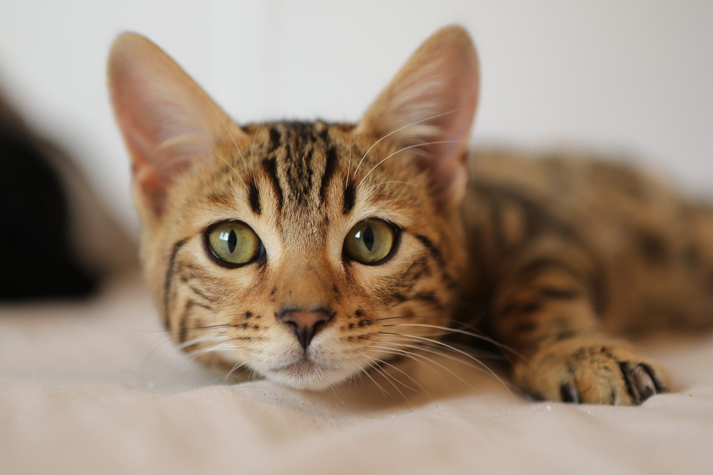

# Dicerr

A small R program that can:
1. Take in an image and output a matrix that describes how to recrate the image with dice.
2. Recreate the image with a collection of die face images.

## Examples

<p align="center">
  
  
</p>

Here is a video (Used ffmpeg to extract original frames, then combine diced frames):
<p align="center">
  
  
</p>

## Getting Started

### Dependencies

Following R packages were used:

* imager
* dplyr
* gtable
* rsvg
* png
* grid
* gridExtra

### Executing program

There is no UI or executable as of now. You can run the code in an R IDE/compiler.

## Help

Any advise for common problems or issues.
```
command to run if program contains helper info
```

## Author

Celine Unal 
me@celineunal.com

## Version History

0.1 Initial release

## License

This project is licensed under the MIT License - see the LICENSE.txt file for details