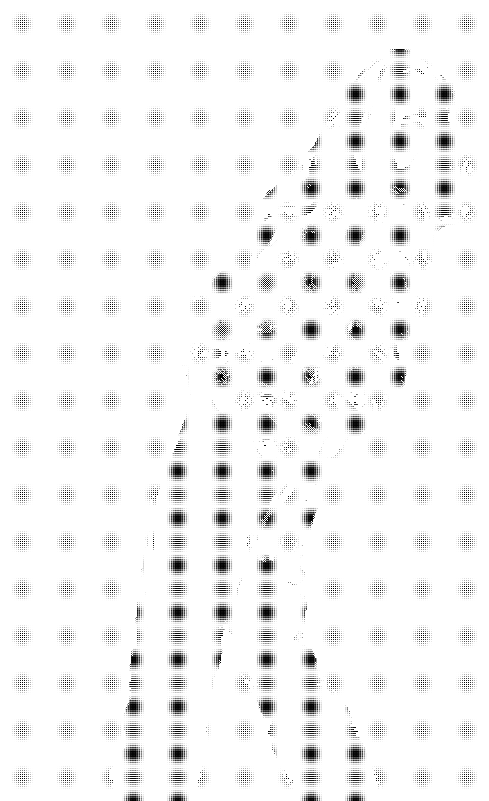

# Dicerr

A small R program that can:

1.  Take in an image and output a matrix that describes how to recrate the image with dice.

2.  Recreate the image with a collection of die face images.

## Examples

 

Here is a video (Used ffmpeg to extract original frames, then combine diced frames):

 

## Getting Started

### Dependencies

Following R packages were used:

-   imager
-   dplyr
-   gtable
-   rsvg
-   png
-   grid
-   gridExtra

### Executing program

There is no UI or executable as of now. You can run the code in an R IDE/compiler.

## Author

Celine Unal [me\@celineunal.com](mailto:me@celineunal.com){.email}

## Version History

0.1 Initial release

## License

This project is licensed under the MIT License - see the LICENSE.txt file for details
